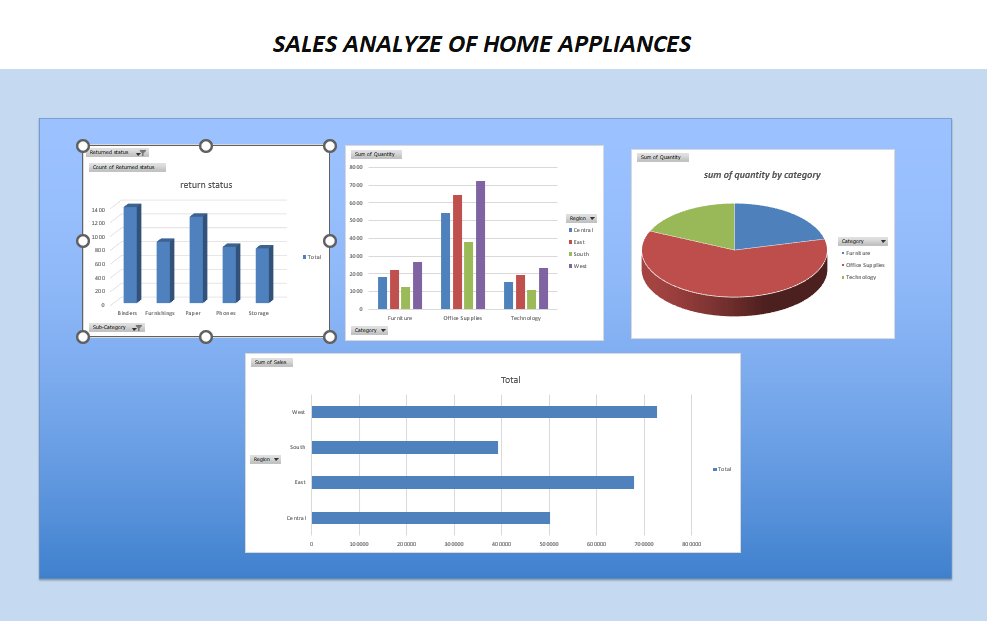

<h1 align="center">🏠📊 Sales Analysis Dashboard – Home Appliances</h1>

📈 Excel Dashboard | 📊 Data Analysis | 🎯 Business Insights

---

<h2>🚀 Project Overview</h2>

This project presents an <b>interactive Sales Analysis Dashboard built using Microsoft Excel</b> 
to analyze the performance of home appliance products across regions and categories.  

The dashboard transforms raw data into <b>meaningful insights</b> using visualizations, helping 
businesses understand sales trends, product performance, and return patterns.

---

<h2>🎯 Objectives</h2>
<ul>
  <li>📊 Analyze regional sales performance</li>
  <li>📦 Identify top product categories</li>
  <li>🔄 Track return status and patterns</li>
  <li>📈 Monitor sales trends and distribution</li>
  <li>💡 Generate actionable business insights</li>
</ul>

---

<h2>🛠️ Tools & Technologies</h2>

---

<h2>📊 Dashboard Features</h2>

<ul>
  <li>📌 <b>Return Status Analysis</b> – Tracks returned products by sub-category</li>
  <li>📦 <b>Category-wise Quantity</b> – Compares Furniture, Office Supplies, Technology</li>
  <li>🥧 <b>Category Distribution</b> – Pie chart showing contribution by category</li>
  <li>🌍 <b>Region-wise Sales</b> – Central, East, South, West performance comparison</li>
  <li>🎛️ <b>Interactive Filters</b> – Dynamic analysis using slicers</li>
</ul>

---

<h2>📷 Dashboard Preview</h2>

---

<h2>🔍 Key Insights</h2>

<ul>
  <li>📈 West region generates the highest sales</li>
  <li>📦 Office Supplies dominate quantity sold</li>
  <li>🔄 Certain sub-categories show higher return rates</li>
  <li>🌍 Regional variations highlight growth opportunities</li>
</ul>

---

<h2>🚀 How to Use</h2>

<ol>
  <li>Download the Excel file</li>
  <li>Open in Microsoft Excel</li>
  <li>Use slicers to filter data</li>
  <li>Interact with charts to explore insights</li>
</ol>

---

<h2>💡 Business Impact</h2>

This dashboard helps businesses to:

<ul>
  <li>📊 Make data-driven decisions</li>
  <li>📦 Optimize inventory and product strategy</li>
  <li>📈 Improve sales performance</li>
  <li>🎯 Target high-performing regions</li>
</ul>

---

<h2>🔮 Future Enhancements</h2>
<ul>
  <li>🤖 Add demand forecasting using Machine Learning</li>
  <li>📊 Build Power BI version of dashboard</li>
  <li>🔄 Automate data updates</li>
</ul>

---

<h2>👤 Author</h2>

<b>MUHAMMED NISHAD PM</b> 
🔗 <a href="https://www.linkedin.com/in/muhammed-nishad-18525a250">LinkedIn</a> 
📧 muhammednishadpm533@gmail.com

---

<h2>⭐ Support</h2>

If you like this project, give it a ⭐ on GitHub!

